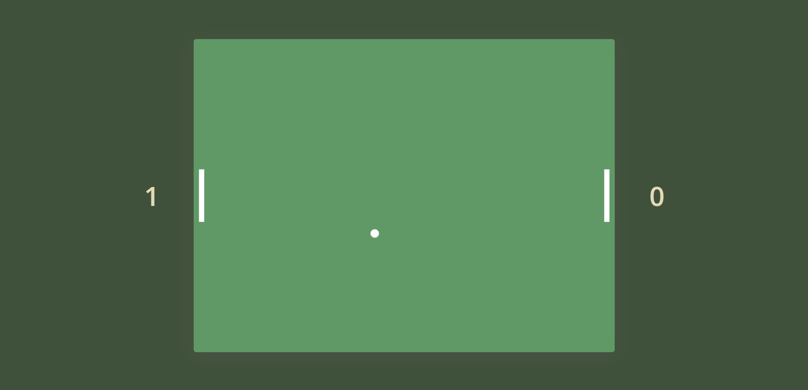

# Ping Pong Game

This is a two-player ping pong game built with HTML, CSS, and JavaScript. The game is played on a single web page and is optimized for desktop and tablet devices.

## Getting Started
To start the game, simply [Click Here](https://ping-pong-game-deepesh.netlify.app/). The game will start automatically and both players can start playing by moving their paddles up and down using the arrow keys.

## Gameplay
The objective of the game is to score points by hitting the ball past the opponent's paddle. The player with the highest score at the end of the game wins. The game is played until one player reaches a predetermined number of points.

## Controls
Player 1: Move paddle up: W key, Move paddle down: S key
Player 2: Move paddle up: Up arrow key, Move paddle down: Down arrow key

## Features
- Simple and intuitive user interface
- Responsive design that adapts to desktop and tablet screen sizes
- Realistic ball physics and sound effects
<!-- - Score tracker for both players -->

## Author
- LinkedIn - [@deepeshsharmaofficial](https://www.linkedin.com/in/deepeshsharmaofficial/)
- Twitter - [@DeepeshSharma48](https://www.twitter.com/@DeepeshSharma48)